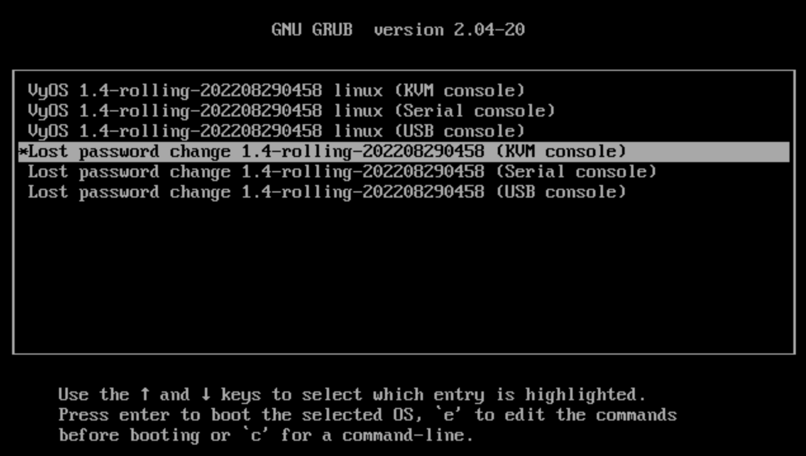

Resetting the password
======================

Using the console, restart the VyOS router. The GRUB menu appears.
Select the relevant option from the GRUB menu and press Enter. The option must start with “Lost password change.”

The stand-alone user-password recovery tool starts running and prompts you to reset the local system user password.

.. code-block:: console

   Do you wish to reset the admin password? (y or n) 
   y
   Which admin account do you want to reset?[vyos]
   my_username
   Enter my_username password: 
   Retype my_username password: 
   System will reboot in 10 seconds...
